# ZETTA WORD - Official Documentation

  

  <strong>Hybrid Financial Technology | Web3 + Fiat</strong>

  
  
  

---

## Overview

ZETTA WORD is a hybrid financial technology project combining Web3 innovation with traditional financial infrastructure. The Z token powers an ecosystem of 23 products designed to bridge decentralized and centralized finance.

## Token Information

| Property | Value |
|----------|-------|
| **Name** | ZETTA WORD |
| **Symbol** | Z |
| **Network** | Binance Smart Chain (BSC) |
| **Standard** | BEP-20 |
| **Contract** | `0x8AaCC38933007eC530c552007E210B4667749DF1` |
| **Total Supply** | 1,000,000,000 (initial) |
| **Final Supply** | 500,000,000 (after pre-fair-launch burn) |
| **Decimals** | 18 |

## Documentation

| Document | Description |
|----------|-------------|
| [Whitepaper](./whitepaper/) | Project vision and roadmap |
| [Tokenomics](./tokenomics/) | Token economics and distribution |
| [Technical Docs](./technical/) | Architecture and specifications |
| [Audit Report](./audit/) | Cyberscope security audit (November 2024) |
| [KYC Verification](./kyc/) | Team identity verification |
| [Audit Responses](./audit-responses/) | Technical responses to audit findings |
| [Smart Contract](./contract/) | Verified source code |

## Security Summary

The ZETTA token has been audited by Cyberscope with the following results:

| Severity | Count | Status |
|----------|-------|--------|
| Critical | 0 | Passed |
| Medium | 0 | Passed |
| Minor/Informative | 14 | Addressed |

All 14 informative findings have been reviewed and documented with technical responses in the [audit-responses](./audit-responses/) directory.

## Links

- **Website:** [zettaword.com](https://zettaword.com) · [zettaword.global](https://zettaword.global)
- **First live product:** [Z-SWAP — swap-z.app](https://swap-z.app)
- **Audit:** [Cyberscope](https://www.cyberscope.io/audits/3-z)
- **Contract:** [BSCScan](https://bscscan.com/token/0x8aacc38933007ec530c552007e210b4667749df1)

---

  ZETTA WORD - Building the Future of Finance

