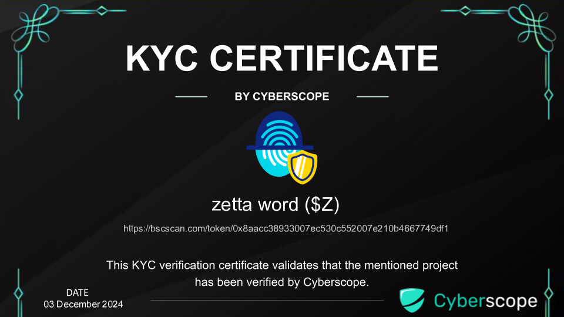

# KYC Verification

## Overview

The ZETTA WORD team has completed Know Your Customer (KYC) verification to demonstrate commitment to transparency and accountability.

## Certificate

  

**File:** [kyc-certificate.png](./kyc-certificate.png)

## What is KYC?

KYC (Know Your Customer) verification in the cryptocurrency space involves:
- Identity verification of team members
- Background checks
- Document verification
- Confirmation of real-world identity

## Why KYC Matters

1. **Accountability**: Team members are publicly identifiable
2. **Trust**: Reduces risk of anonymous rug pulls
3. **Compliance**: Demonstrates regulatory awareness
4. **Transparency**: Shows commitment to legitimate operations

## Verification Status

| Item | Status |
|------|--------|
| Team Identity | Verified |
| Document Check | Completed |
| Background Review | Passed |

## Contact

For verification inquiries:
- **Website:** [zettaword.com](https://zettaword.com)
- **Telegram:** @ZettaWordOfficial

---

*KYC verification is one component of a comprehensive trust framework. Always conduct your own research before investing.*
